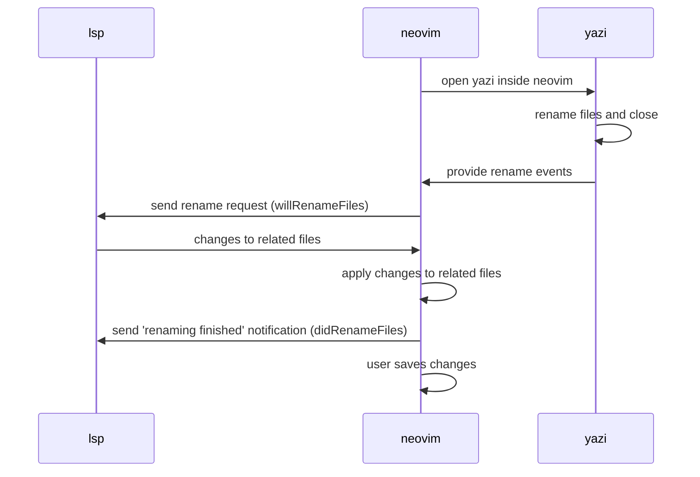

# Lsp file renaming feature

This document explains how this plugin works with yazi and the LSP (language
server protocol) server to provide renaming functionality for files.

## What is LSP file renaming?

Many LSP servers support a feature where the user can rename a file in the
project. The LSP server can help the user by renaming all references to the file
in the project.

For example, if you have a file that's imported in many other files, you can
rename the file and the LSP server will update all the references to the new
file name.

> [!NOTE]
>
> The LSP server must already be running for file renaming to work. For example,
> when you open a file in neovim, an LSP server is typically automatically
> started in the background.

## How does this plugin work with LSP file renaming?

When files are renamed in yazi, this plugin will detect that via events that
yazi sends using its Data Distribution Service (DDS), specifically the
[rename events](https://yazi-rs.github.io/docs/dds/#rename).

Here is a sequence diagram that shows the different actors and steps involved in
the file renaming process:

LSP specification links for file renaming:

- [workspace/willRenameFiles](https://microsoft.github.io/language-server-protocol/specifications/lsp/3.17/specification/#workspace_willRenameFiles)
- [workspace/didRenameFiles](https://microsoft.github.io/language-server-protocol/specifications/lsp/3.17/specification/#workspace_didRenameFiles)

## Debugging for developers

The e2e test environment should enable logging of all lsp requests and
responses. Each test run has its own log file, and you can find it in a
directory such as
`integration-tests/test-environment/testdirs/dir-rNJosm/.local/state/nvim/lsp.log`
