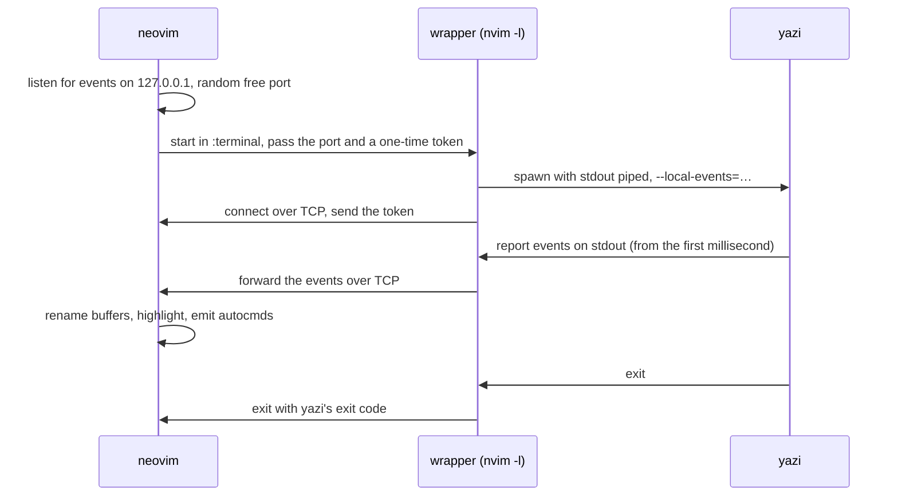

# Reading events from yazi (`use_local_events`)

> [!NOTE]
>
> This is an experimental opt-in feature. Enable it with
>
> ```lua
> require("yazi").setup({
>   future_features = {
>     use_local_events = true,
>   },
> })
> ```

## The problem

yazi.nvim keeps Neovim in sync with what happens inside yazi (renames, moves, deletes, the hovered file, …) by
subscribing to yazi's [DDS](https://yazi-rs.github.io/docs/dds) events.

Until now that was done with a second process, `ya sub`, which connects to the running yazi over DDS. `ya sub` can only
be started _after_ yazi has started, and it retries the connection once per second. Anything that happens before it
connects is never delivered.

In practice that means a rename done in the first moment after yazi opens does not propagate to the open buffer. The
window is usually small enough not to matter, but it grows with anything that makes starting a process slow - Windows in
general, or a live malware scanner that inspects every new executable.

See [the upstream discussion](https://github.com/sxyazi/yazi/discussions/4139) for the report and the analysis.

## The approach

yazi can report its own events straight to _its own stdout_ with `--local-events`, which makes `ya sub` unnecessary -
the events are then available from yazi's very first millisecond, and nothing can be dropped.

yazi.nvim could not use that on its own. yazi is interactive, so it has to run in Neovim's `:terminal`, and the embedded
terminal hands the child a pty for stdin, stdout and stderr alike; it cannot read the stream separately while the
program is running.

So yazi.nvim starts a small wrapper program in the terminal instead of yazi. The wrapper spawns yazi as its child with a
real pipe for stdout, while stdin, stderr and the controlling terminal are passed through untouched, and forwards
everything yazi writes back to yazi.nvim over a loopback TCP socket:



This does not disturb the UI, because yazi draws to the controlling terminal (`/dev/tty`, or `CONOUT$` on Windows) and
not to stdout.

The wrapper is
[`lua/yazi/process/event_source/local_events_wrapper.lua`](../lua/yazi/process/event_source/local_events_wrapper.lua),
run by `nvim -l` - Neovim as a plain Lua interpreter. That needs no new dependency, costs about 20ms, and does not load
your Neovim config.
